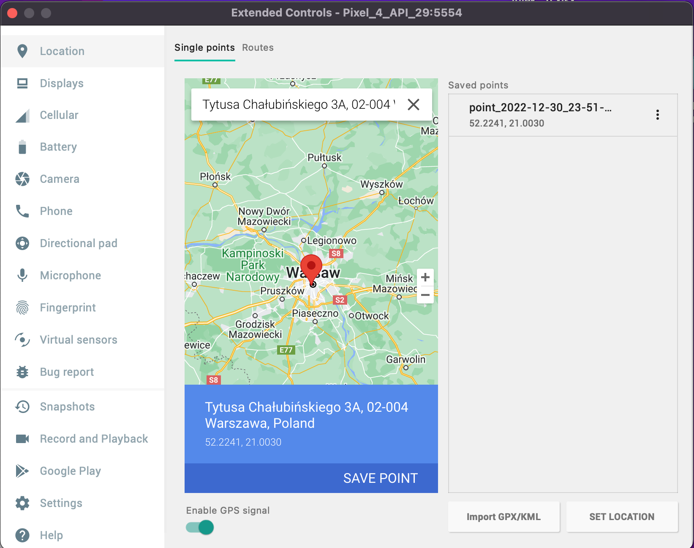

[DeeDee](https://github.com/dinobitsoft/deedee-flutter)\-flutter
================================================================

* * *

### To generate localization
* windows: <flutter_installation_dir>\bin\flutter gen-l10n
* linux <flutter_installation_dir>/bin/flutter gen-l10n

### To set the GPS on the emulator:

Go to the emulator settings, tab "Location"

On the map in the emulator select a new point

Save the data, press "SAVE POINT" then press "SET LOCATION"

* * *